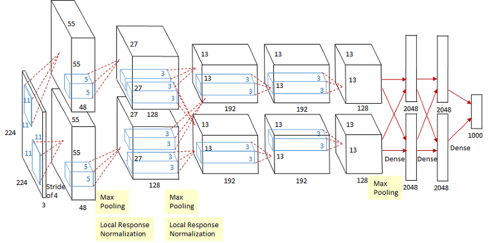
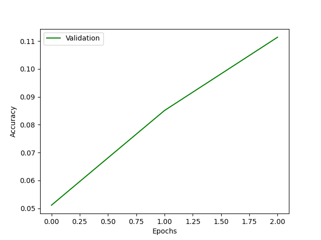

# Alexnet

|    Layer    	| Feature Map 	|    Size   	| Kernel Size 	| Stride 	| Padding 	| Activation 	|
|:-----------:	|:-----------:	|:---------:	|:-----------:	|:------:	|:-------:	|:----------:	|
|    Image    	|      1      	| 227x227x3 	|      -      	|    -   	|    -    	|      -     	|
| Convolution 	|      96     	|  55x55x96 	|    11x11    	|    4   	|    0    	|    relu    	|
| Max Pooling 	|      96     	|  27x27x96 	|     3x3     	|    2   	|    0    	|    relu    	|
| Convolution 	|     256     	| 27x27x256 	|     5x5     	|    1   	|    2    	|    relu    	|
| Max Pooling 	|     256     	| 13x13x256 	|     3x3     	|    2   	|    0    	|    relu    	|
| Convolution 	|     384     	| 13x13x384 	|     3x3     	|    1   	|    1    	|    relu    	|
| Convolution 	|     384     	| 13x13x384 	|     3x3     	|    1   	|    1    	|    relu    	|
| Convolution 	|     256     	| 13x13x256 	|     3x3     	|    1   	|    1    	|    relu    	|
| Max Pooling 	|     256     	|  6x6x256  	|     3x3     	|    2   	|    0    	|    relu    	|
|      FC     	|      -      	|    9216   	|      -      	|    -   	|    -    	|    relu    	|
|      FC     	|      -      	|    4096   	|      -      	|    -   	|    -    	|    relu    	|
|      FC     	|      -      	|    4096   	|      -      	|    -   	|    -    	|    relu    	|
|  FC(Output) 	|      -      	|    1000   	|      -      	|    -   	|         	|   Softmax  	|

# Benchmark
- with ImageNET LSVRC-2012 dataset(https://academictorrents.com/details/a306397ccf9c2ead27155983c254227c0fd938e2)
- Error can be reduced by increasing epochs, but it takes too much time to training. Therefore I trained with only 3 epochs.

# Reference
- https://bskyvision.com/421
- https://github.com/pytorch/vision/blob/master/torchvision/models/alexnet.py
- https://papers.nips.cc/paper/4824-imagenet-classification-with-deep-convolutional-neural-networks.pdf