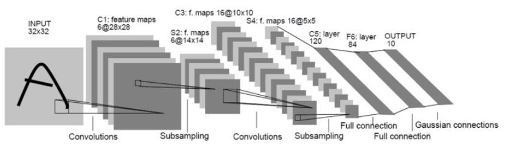
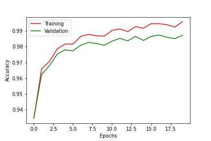

# LeNet-5


|      Layer      	| Feature Map 	|  Size 	| Kernel Size 	| Stride 	| Activation 	|
|:---------------:	|:-----------:	|:-----:	|:-----------:	|:------:	|:----------:	|
|      Image      	|      1      	| 32x32 	|      -      	|    -   	|      -     	|
|   Convolution   	|      6      	| 28x28 	|     5x5     	|    1   	|    tanh    	|
| Average Pooling 	|      6      	| 14x14 	|     2x2     	|    2   	|    tanh    	|
|   Convolution   	|      16     	| 10x10 	|     5x5     	|    1   	|    tanh    	|
| Average Pooling 	|      16     	|  5x5  	|     2x2     	|    2   	|    tanh    	|
|   Convolution   	|     120     	|  1x1  	|     5x5     	|    1   	|    tanh    	|
|        FC       	|      -      	|   84  	|      -      	|    -   	|    tanh    	|
|    FC(Output)   	|      -      	|   10  	|      -      	|    -   	|   softmax  	|

# Benchmark
- with MNIST dataset
```
epoch:  0 , loss:  1.3276588759105652
epoch:  1 , loss:  0.2250607525772648
epoch:  2 , loss:  0.13610451365908374
epoch:  3 , loss:  0.10103889226389583
epoch:  4 , loss:  0.08251364173018373
epoch:  5 , loss:  0.07012207184190629
epoch:  6 , loss:  0.060544071580443413
epoch:  7 , loss:  0.05420622506320796
epoch:  8 , loss:  0.047777413640396844
epoch:  9 , loss:  0.04459851183177307
epoch:  10 , loss:  0.03973049619076846
epoch:  11 , loss:  0.036696361950498614
epoch:  12 , loss:  0.03379271781784155
epoch:  13 , loss:  0.03130722646704271
epoch:  14 , loss:  0.02822430754164998
epoch:  15 , loss:  0.026276124932660423
epoch:  16 , loss:  0.023956964996318674
epoch:  17 , loss:  0.022332314817831503
epoch:  18 , loss:  0.020845588584807048
epoch:  19 , loss:  0.019578911309890826

Classifier Accuracy:  98.83999633789062
```



# Reference
- https://reniew.github.io/07/
- https://github.com/bollakarthikeya/LeNet-5-PyTorch/blob/master/lenet5_gpu.py